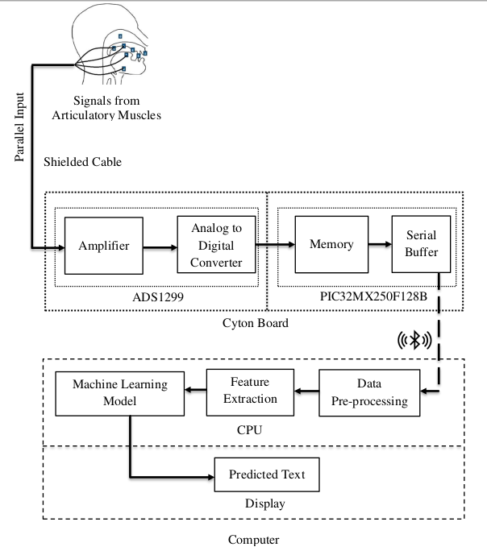

# Silent-Interface-for-IOT-Devices

Since the development of the very first computer, human-computer interaction has always required to have some form of physical activity as an input to the computer. Although these methods are accurate and hassle-free, they fail to be intelligible to the differently-abled. Speech interaction tackles this issue to some extent but it is still subjected to privacy issues. The proposed system in this research project confronts these problems and provides a secure and seamless interaction between a human and a computer using silent speech recognition. The surface electromyography (sEMG) signals, during the silent speech, are recorded from the facial muscles of a speaker using 8-channel gold cup electrodes and filtered to remove noise and other unwanted signals. The spectrogram of the processed signal is then extracted to train a Convolution Neural Network (CNN). The trained model is finally deployed to predict the utterances.

## Muscle Selection
During internal articulation (without acoustic vocalization), no significant movement of facial muscles or articulators is observed, however, more than 15 muscles directly involved in the speech system are neurologically activated. These particular muscles receive feeble electrical signals from the peripheral nervous system(PNS). Depending on the extent of involvement, various facial muscles were selected for signal extraction. Many factors such as noise susceptibility, signal strength, cross-talk, signal frequency, nature of electrode, electrode-muscle distance, electrode configuration, and convenience for placement are considered during muscles selection.

## Project Description
The extracted analog EMG signal from the electrodes of all 8 channels is fed into respective differential amplifiers which eliminates any common mode noise and amplifies the signals according to the gain of the PGA (Programmable Gain Amplifier) which was set at 24 from the OpenBCI GUI. The differential output of the PGA is digitized using the 24 bit sigma-delta ADC within ADS1299. The signals are sampled at a frequency of 250 Hz. The PIC microcontroller is heavily involved in fetching digitized data from ADS1299 and sending the data to the Bluetooth module for wireless transmission. The wirelessly transmitted data from the Cyton board is received by the bluetooth receiver embedded on the USB dongle. Then the USB-to-TTL converter on the USB dongle sends the data from the bluetooth module to the computer through USB. The digitized signals are further processed using various procedures like digital filters (1.5-
50 Hz 1st order Butterworth filter and  1st order notch filter at 50 Hz), signal smoothing, and feature extraction (temporal and spectral) before it feeding to the neural network. This pipeline outputs the features which are further passed to a pre-trained model. The model then predicts the
utterance on the basis of the features and the predicted utterance is finally displayed on the display unit of a remote computer.

